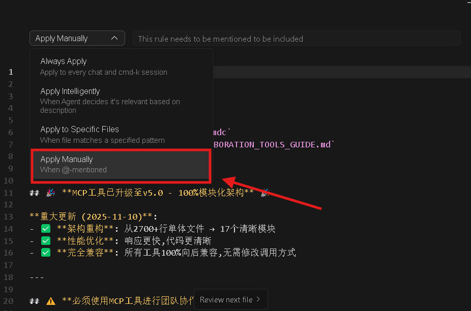
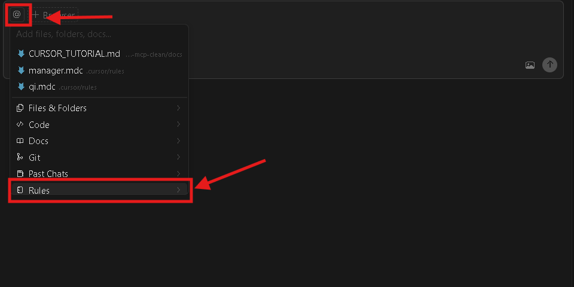
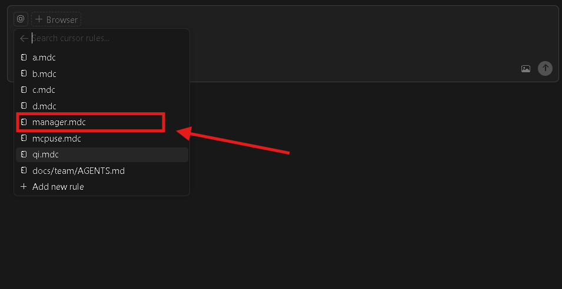

# AI Team MCP - Cursor 使用教程

> **教程目的**: 帮助您在Cursor中快速上手AI Team MCP工具,实现多AI代理协作
> **适用人群**: Cursor 用户

---

## 📋 目录

1. [什么是MDC文件](#什么是mdc文件)
2. [配置MCP服务器](#配置mcp服务器)
3. [创建员工提示词](#创建员工提示词)
4. [基本使用流程](#基本使用流程)
5. [常见问题](#常见问题)

---

## 🎯 什么是MDC文件

### 基本概念

**MDC文件** (`.mdc` = **M**arkdown **D**ocument with **C**ursor metadata) 是Cursor特有的规则文件格式,用于定义AI代理的行为、职责和工作流程。

### 文件结构

```markdown
---
alwaysApply: false
---
# AI代理标题

> **规则文件位置**: `.cursor/rules/agent_name.mdc`

## 核心内容

- 职责定义
- 工作流程
- 代码规范
- 协作规范
```

### 关键特性

1. **YAML前置内容** (Front Matter)

   ```yaml
   ---
   alwaysApply: false  # ⚠️ 必须设置为 false - 手动激活,防止角色混淆
   ---
   ```
2. **Markdown格式**: 使用标准Markdown语法编写规则
3. **位置**: 存放在 `.cursor/rules/` 目录下
4. **激活方式** ⚠️ **强烈建议手动激活**:

   - ✅ **推荐**: 在Cursor中使用 `@Rules` 手动选择 → 防止提示词混淆
   - ❌ **不推荐**: 设置 `alwaysApply: true` 自动应用 → 可能导致多个角色同时生效

**为什么必须手动激活?**

- AI Team MCP有5个不同角色(manager, a, b, c, d)
- 如果多个规则同时生效,AI会混淆角色职责
- 手动激活确保每次只扮演一个角色

[图片占位符: cursor-rules-selection.png - 展示Cursor中选择Rules的界面]

---

## 🔧 配置MCP服务器

### 第一步: 安装依赖

```bash
pip install mcp
```

### 第二步: 配置MCP.json

**位置**: `~/.cursor/mcp.json` (Windows: `C:\Users\<用户名>\.cursor\mcp.json`)

```json
{
  "mcpServers": {
    "ai-team-manager": {
      "command": "python",
      "args": ["-m", "mcp_ai_chat.server_modular"],
      "cwd": "/path/to/ai-team-mcp"
    }
  }
}
```

**配置说明**:

- `command`: Python解释器命令
- `args`: MCP服务器入口模块
- `cwd`: MCP服务器代码目录 (替换为您的实际路径)

[图片占位符: mcp-config-location.png - 展示mcp.json文件位置]

### 第三步: 重启Cursor

配置完成后,**必须重启Cursor**以加载MCP服务器。

### 第四步: 验证安装

在Cursor的AI助手中输入:

```
请使用register_agent工具注册一个测试代理
```

如果看到注册成功消息,说明MCP服务器配置正确! 🎉

[图片占位符: mcp-verification.png - 展示MCP工具调用成功的界面]

---

## 👥 创建员工提示词

### 提示词文件位置

所有员工提示词文件存放在 `.cursor/rules/` 目录:

```
.cursor/
└── rules/
    ├── manager.mdc      # 产品经理
    ├── a.mdc            # 员工A - 前端开发
    ├── b.mdc            # 员工B - 后端开发
    ├── c.mdc            # 员工C - 全栈开发
    └── d.mdc            # 员工D - 测试/运维
```

### 五个员工角色

| 文件名          | 角色            | 职责                         |
| --------------- | --------------- | ---------------------------- |
| `manager.mdc` | 产品经理        | 任务管理、团队协调、质量验收 |
| `a.mdc`       | 前端开发工程师  | 前端功能开发、UI/UX优化      |
| `b.mdc`       | 后端开发工程师  | 后端API开发、数据库设计      |
| `c.mdc`       | 全栈开发工程师  | 前后端集成、API文档          |
| `d.mdc`       | 测试/运维工程师 | 测试体系、CI/CD流程          |

### 提示词文件内容

完整的提示词文件已包含在本仓库中,位于:

- `ai-team-mcp-clean/.cursor/rules/manager.mdc`
- `ai-team-mcp-clean/.cursor/rules/a.mdc`
- `ai-team-mcp-clean/.cursor/rules/b.mdc`
- `ai-team-mcp-clean/.cursor/rules/c.mdc`
- `ai-team-mcp-clean/.cursor/rules/d.mdc`

**您可以直接复制这些文件到您项目的 `.cursor/rules/` 目录**。

---

## 🚀 基本使用流程

### 第零步: 复制并配置提示词文件 ⚠️ **必须先完成**

#### 1. 复制提示词文件到Cursor规则目录

将仓库中的5个MDC文件复制到您的项目:

```bash
# 从仓库复制到您的项目
cp ai-team-mcp-clean/.cursor/rules/*.mdc 您的项目/.cursor/rules/
```

或者手动复制以下文件:

- `ai-team-mcp-clean/.cursor/rules/manager.mdc` → `您的项目/.cursor/rules/manager.mdc`
- `ai-team-mcp-clean/.cursor/rules/a.mdc` → `您的项目/.cursor/rules/a.mdc`
- `ai-team-mcp-clean/.cursor/rules/b.mdc` → `您的项目/.cursor/rules/b.mdc`
- `ai-team-mcp-clean/.cursor/rules/c.mdc` → `您的项目/.cursor/rules/c.mdc`
- `ai-team-mcp-clean/.cursor/rules/d.mdc` → `您的项目/.cursor/rules/d.mdc`

#### 2. 确保文件头设置为手动激活 ⚠️ **重要**

检查每个 `.mdc` 文件的YAML前置内容,确保设置为 `alwaysApply: false`:

```yaml
---
alwaysApply: false  # ⚠️ 必须设置为 false,防止提示词混淆
---
```



**为什么必须设置为 `false`?**

- ✅ **防止提示词混淆**: 不同员工的规则不会同时生效
- ✅ **角色明确**: 每次只激活一个AI代理角色
- ✅ **职责清晰**: 避免AI同时扮演多个角色导致行为混乱

#### 3. 重启Cursor

复制文件后,**必须重启Cursor**以加载新的规则文件。

[图片占位符: copy-mdc-files.png - 展示复制MDC文件的过程]

---

### 场景1: 产品经理分配任务

#### 1. 手动激活产品经理规则

在Cursor中,使用 `@Rules` 选择 `manager.mdc`





**重要提示**: 确保只选择了 `manager.mdc`,不要同时选择其他规则文件!

#### 2. 注册AI代理

```
请注册AI代理manager
```

AI会自动调用 `register_agent` 工具。

#### 3. 创建并分配任务

```
创建一个P1任务"优化用户登录UI",分配给员工A,截止日期2025-12-01
```

AI会自动:

- 调用 `create_task` 创建任务
- 调用 `assign_task` 分配任务
- 调用 `send_message` 通知员工A

---

### 场景2: 员工A执行任务

#### 1. 手动激活员工A规则

在**新的Cursor窗口或Chat**中,使用 `@Rules` 选择 `a.mdc`

**重要提示**:

- ✅ 只选择 `a.mdc`,取消其他规则(包括 `manager.mdc`)
- ✅ 建议使用新的Chat窗口,避免与产品经理角色混淆

#### 2. 注册AI代理

```
请注册AI代理a
```

#### 3. 查看任务

```
查看我的任务
```

AI会调用 `get_tasks({"assignee": "a"})` 获取任务列表。

#### 4. 接收消息

```
查看我的未读消息
```

AI会调用 `receive_messages({"recipient": "a", "unread_only": true})`。

#### 5. 完成任务

开发完成后:

```
更新任务状态为已完成,并通知manager
```

AI会:

- 调用 `update_task_status` 更新状态
- 调用 `notify_completion` 通知manager

---

### 场景3: 员工协作

#### 员工A请求后端API支持

```
我需要员工B实现一个用户登录API,请求帮助
```

AI会调用 `request_help` 工具。

#### 员工B接收请求

在员工B的Cursor窗口:

```
查看我的未读消息
```

看到员工A的请求后,实现API并回复:

```
发送消息给员工A: API已实现,详见backend/routers/auth.py
```

---

## 📊 完整工作流程图

```
1. Manager创建任务 → 2. Manager分配任务给员工A
                     ↓
3. 员工A查看任务 → 4. 员工A请求帮助(员工B)
                     ↓
5. 员工B接收请求 → 6. 员工B实现API
                     ↓
7. 员工B通知员工A → 8. 员工A完成开发
                     ↓
9. 员工A通知Manager → 10. Manager验收
```

---

## 💡 最佳实践

### 1. 为每个AI开独立窗口或Chat ⚠️ **重要**

- **产品经理**: Cursor窗口1 (仅使用 `@Rules` 选择 `manager.mdc`)
- **员工A**: Cursor窗口2 或 Chat 2 (仅使用 `@Rules` 选择 `a.mdc`)
- **员工B**: Cursor窗口3 或 Chat 3 (仅使用 `@Rules` 选择 `b.mdc`)
- **员工C**: Cursor窗口4 或 Chat 4 (仅使用 `@Rules` 选择 `c.mdc`)
- **员工D**: Cursor窗口5 或 Chat 5 (仅使用 `@Rules` 选择 `d.mdc`)

**关键原则**:

- ✅ **一个窗口/Chat只激活一个规则** - 防止角色混淆
- ✅ **手动选择规则** - 使用 `@Rules` 明确激活,不要使用 `alwaysApply: true`
- ✅ **检查激活状态** - 确认当前只有一个规则在生效

### 2. 使用待命模式

完成工作后,让AI进入待命状态:

```
进入待命模式,监听新任务和消息
```

AI会自动调用 `standby` 工具,持续监听5分钟。

### 3. 定期查看任务进度

产品经理应定期检查:

```
查看所有任务的进度
```

### 4. 创建项目群组

对于大型项目,创建群组:

```
创建项目群组"用户认证模块",成员包括manager、a、b、c、d
```

在群组中发送消息:

```
在用户认证模块群组中发送消息: 请各位同步进度
```

---

## 🔍 常见问题

### Q1: MCP工具无法使用

**问题**: AI提示"找不到MCP工具"

**解决方案**:

1. 检查 `mcp.json` 配置是否正确
2. 确认路径 `cwd` 是否指向正确的MCP服务器目录
3. 重启Cursor
4. 验证Python环境是否安装了 `mcp` 包

### Q2: Rules无法激活

**问题**: 无法使用 `@Rules` 选择规则文件

**解决方案**:

1. 确认 `.mdc` 文件放在 `.cursor/rules/` 目录下
2. 检查文件是否包含YAML前置内容
3. 重启Cursor

### Q3: AI没有自动调用MCP工具

**问题**: AI只是回答,没有调用工具

**解决方案**:

1. 明确指示AI使用工具: "请使用create_task工具创建任务"
2. 检查Rules文件是否正确激活
3. 确认MCP服务器是否正常运行

### Q4: 多个AI窗口如何协作

**问题**: 如何让不同窗口的AI互相通信

**解决方案**:

- AI之间通过MCP工具通信,不是通过Cursor窗口
- 每个窗口的AI都连接到同一个MCP服务器
- 使用 `send_message` 发送消息,`receive_messages` 接收消息

### Q5: 任务ID是什么格式

**问题**: 任务ID格式不清楚

**解决方案**:

- 格式: `TASK_YYYYMMDDHHMMSS_序号`
- 示例: `TASK_20251126200151_0`
- 创建任务后会返回任务ID,复制使用即可

---

## 📚 进一步学习

### 文档资源

- [API参考文档](API_REFERENCE.md) - 所有28个工具的详细说明
- [架构指南](ARCHITECTURE.md) - MCP服务器架构设计
- [示例场景](EXAMPLES.md) - 更多真实使用案例
- [故障排除](TROUBLESHOOTING.md) - 常见问题解决

### 社区资源

- GitHub Issues: 报告问题和反馈
- GitHub Discussions: 讨论和交流
- 示例项目: 查看真实项目案例

---

## 🎉 快速开始清单

- [ ] 安装 `mcp` Python包
- [ ] 配置 `~/.cursor/mcp.json`
- [ ] 复制5个 `.mdc` 文件到 `.cursor/rules/`
- [ ] **确认所有 `.mdc` 文件设置为 `alwaysApply: false`** ⚠️
- [ ] 重启Cursor
- [ ] 使用 `@Rules` 手动选择 `manager.mdc`
- [ ] 测试注册AI代理
- [ ] 创建第一个任务
- [ ] 使用 `@Rules` 切换到员工规则
- [ ] 体验AI团队协作!

---

**祝您使用愉快!** 🚀

如有问题,请查看 [故障排除文档](TROUBLESHOOTING.md) 或提交 [GitHub Issue](https://github.com/yourusername/ai-team-mcp/issues)。

---

**文档版本**: v1.0
**最后更新**: 2025-11-26
**维护者**: AI Team MCP Community
